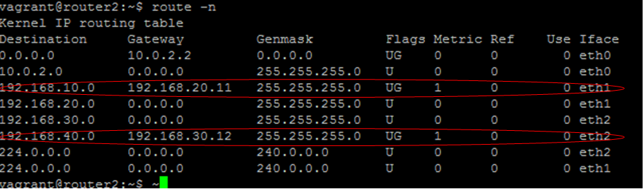

# Arachne
Arachne is a Java-based routing library. This runs on simple Linux VMs, and makes such VMs to take on the role of a sophosticated router.As of now, it has implementation for RIPv2 protocol over UDP.

## Set-up steps
### Build
mvn is the build tool. `mvn clean package` will generate the artfifact jar.
### Sample network diagram
  
### VMs set up
This library has been tested on Ubuntu VMs running over Oracle Virtual Box.A combination of Vagrant and Ansible has been used to install/configure the VMs.
1. On the host machine, Oracle Virtual Box and Vagrant should be present.
2. Minimum of 16 GB RAM is required on the host machine for optimal VM performance wrt sample configuration.
3. Add the Vagrant Box (representing ubuntu/trusty64 OS image) to the host machine with command - `vagrant box add ubuntu/trusty64`
4. To install the VMs, go to setup/vagrant directory and run - `vagrant up`. The sample VM configuration wil set up a total of 8 VMs, with one of the VMs being the workstation VM.Here-onwards, all the other VM configurations are done through the workstation VM.
5. ssh to the workstation VM.
6. Copy the build artifact jar to `~/deploy/target`
7. Execute script to bring up the Routing Java service on all other VMs. `~/deploy/target/scripts/runInstall.sh` 
8. Verify that the Java process has succesfully run in all the VMs.
9. After succesful run of the `runInstall.sh` script, we will be able to see dynamically discovered route getting automatically added to the respective VMs.
10.Attached below is the route table of `ROUTER2` with dynamically added routes highlighted in red.
  
